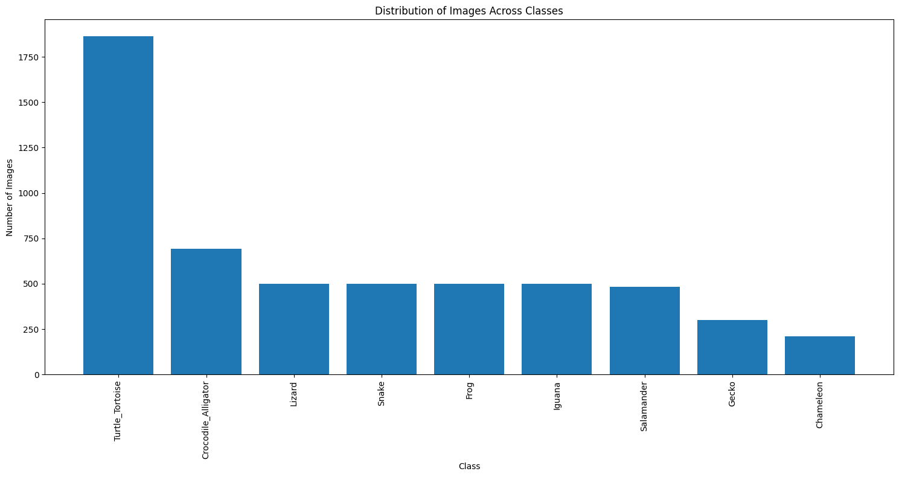

# 🐍 Reptile & Amphibian Image Classification

## 📘 Project Description
Dieses Projekt klassifiziert verschiedene Arten von Reptilien und Amphibien anhand von Bildern. Als Modell wurde ein **ResNet50** verwendet, das mithilfe von Transfer Learning auf einem benutzerdefinierten Bilddatensatz trainiert wurde.

---

## 🔗 Name & URL

| Name         | URL |
|--------------|-----|
| Huggingface Space | [Zur Anwendung](https://huggingface.co/spaces/Straueri/ReptileAmphibianClassification) |
| Modellseite       | [Zum Modell](https://huggingface.co/Straueri/ReptileAmphibianClassification) |
| GitHub Repository | [Zum Code](https://github.com/ericstrausak/Image-Classification) |

---

## 🏷️ Labels

Die erkannten Arten sind:

```python
['snake', 'frog', 'lizard', 'turtle', 'salamander', 'gecko', 'toad']  # <-- aus class_names.json
```

*(Ersetze durch deine tatsächlichen Klassennamen)*

---

## 🗂️ Datenquellen

| Datenquelle         | Beschreibung |
|---------------------|--------------|
| Reptiles Dataset    | Sammlung von Bildern aus öffentlichen Quellen (z. B. Kaggle), sortiert nach Klassenordnern. |
| Manuell annotiert   | Zusätzlich wurden ggf. Bilder aus dem Internet ergänzt und manuell gelabelt. |

---

## 🔄 Datenaufbereitung & Augmentierung

Bilder wurden automatisch aufgeteilt: **70 % Training**, **15 % Validierung**, **15 % Test**.

| Augmentation                  | Beschreibung |
|------------------------------|--------------|
| `Resize(224, 224)`           | Einheitliches Bildformat |
| `RandomHorizontalFlip()`     | Zufällige horizontale Spiegelung |
| `RandomRotation(15)`         | Leichte Bildrotation |
| `ColorJitter(...)`           | Variationen in Helligkeit, Kontrast, Sättigung |

---

## ⚙️ Modellarchitektur

- **Basis:** `torchvision.models.resnet50`
- **Anpassung:** Die finale FC-Schicht wurde an die Anzahl der Klassen angepasst.
- **Optimierer:** Adam
- **Scheduler:** ReduceLROnPlateau
- **Loss Function:** CrossEntropyLoss

---

## 🏋️‍♀️ Trainingsdetails

| Hyperparameter        | Wert |
|-----------------------|------|
| Lernrate              | 0.001 |
| Batch-Größe (Train)   | 32 |
| Batch-Größe (Eval)    | 32 |
| Epochs                | 5–15 |
| Optimizer             | Adam |
| Seed                  | 42 |

---

### 📊 Training Metrics

| Epoch | Training Loss | Validation Loss | Accuracy |
|-------|----------------|-----------------|----------|
| 1     | 0.3582         | 0.2997          | 92.56%   |
| 2     | 0.2125         | 0.2200          | 94.18%   |
| 3     | 0.1573         | 0.1966          | 94.05%   |
| 4     | 0.1472         | 0.1884          | 94.45%   |
| 5     | 0.1338         | 0.1865          | 94.72%   |

---

## 🧪 Evaluation

- **Test Accuracy:** ~94.7 %
- **Verwendete Metriken:** Accuracy, Confusion Matrix (siehe unten)

---

## 🔍 Zero-Shot Vergleich (CLIP)

Zusätzlich wurde `openai/clip-vit-b-32` zur Zero-Shot-Evaluierung verwendet.

| Methode                                | Accuracy | Precision | Recall |
|----------------------------------------|----------|-----------|--------|
| CLIP Zero-Shot                         | ~88 %    | -         | -      |
| ResNet50 (Transfer Learning, Aug.)     | ~94.7 %  | -         | -      |

---

## 📁 Projektstruktur

```
project/
│
├── app.py                  # Inferenzlogik
├── deployment/
│   ├── reptile_classifier.pth
│   └── class_names.json
├── data/
│   ├── train/
│   ├── val/
│   └── test/
├── doc/
│   ├── class_distribution.png
│   └── sample_predictions.png
└── README.md
```

---

## 📷 Visualisierungen

| Beschreibung                 | Bild |
|-----------------------------|------|
| Klassenverteilung           |  |
| Beispielhafte Vorhersagen   |  |

---

## 🛠️ Verwendete Bibliotheken

- `torch` ≥ 2.0
- `torchvision`
- `scikit-learn`
- `matplotlib`, `PIL`
- optional: `gradio` für die Space

---

## 📌 Hinweise

- Modell wurde lokal auf CPU/GPU trainiert.
- Gradio-App erlaubt Hochladen von Bildern zur Laufzeit.
- Deployment erfolgt über Hugging Face Spaces.

---

## 👤 Autoren & Lizenz

- **Autor:** Dein Name
- **Lizenz:** Apache 2.0
